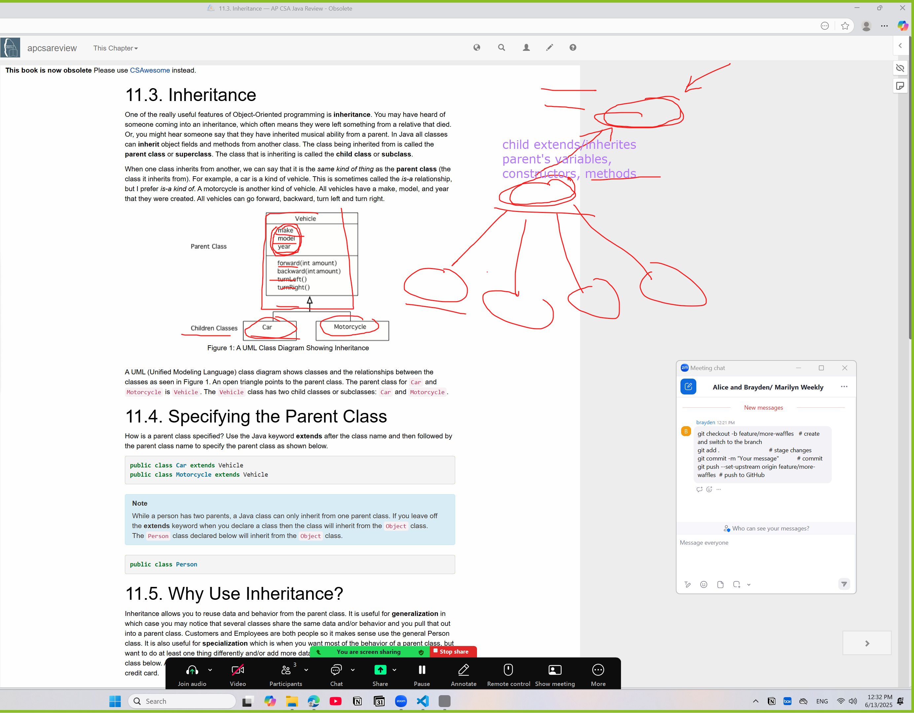
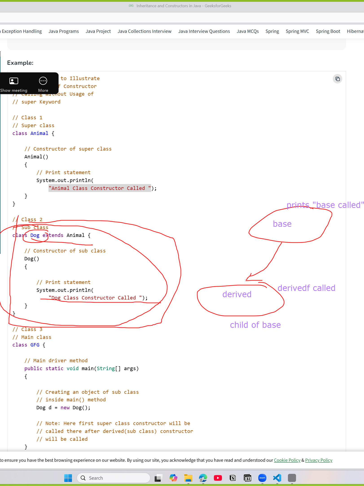
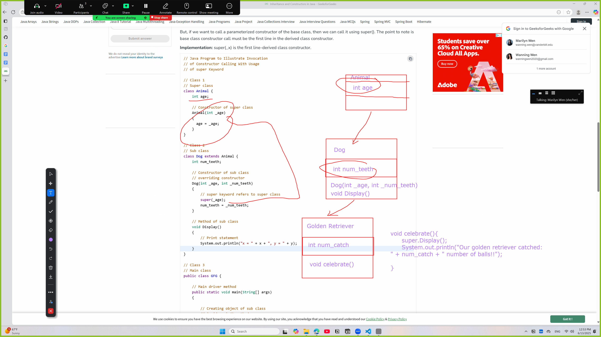
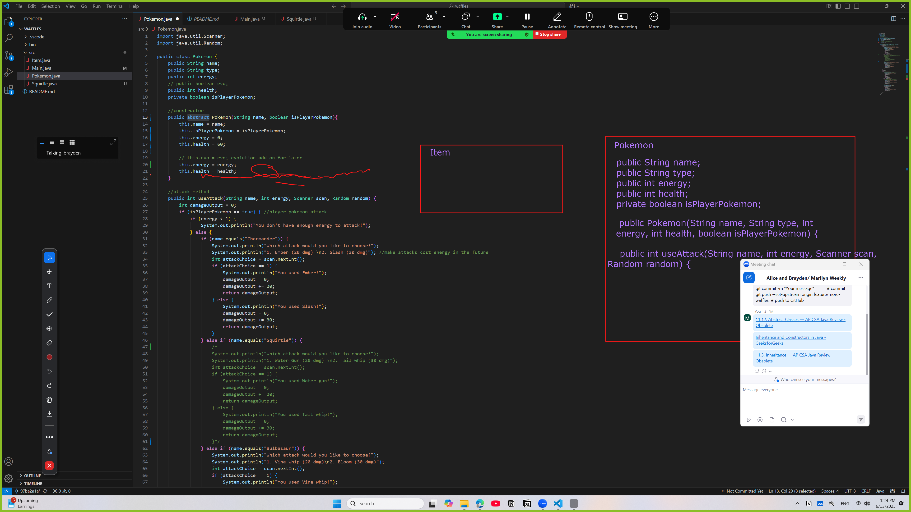
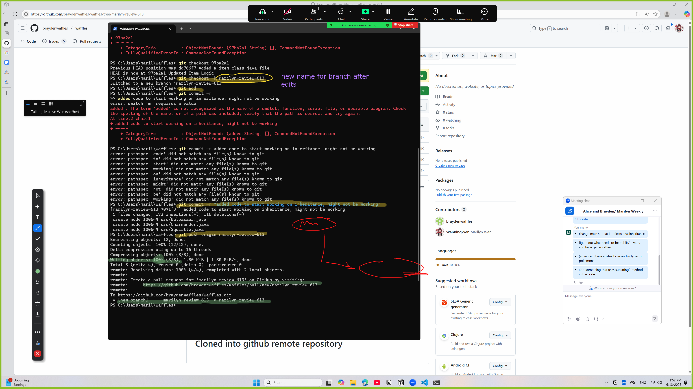

# Materials used in zoom 6-13

## Links:
[11.12. Abstract Classes — AP CSA Java Review - Obsolete](https://runestone.academy/runestone/static/JavaReview/OOBasics/ooAbstract.html)
[Inheritance and Constructors in Java - GeeksforGeeks](https://www.geeksforgeeks.org/inheritance-and-constructors-in-java/) 
[11.3. Inheritance — AP CSA Java Review - Obsolete](https://runestone.academy/ns/books/published/apcsareview/OOBasics/ooInheritance.html)